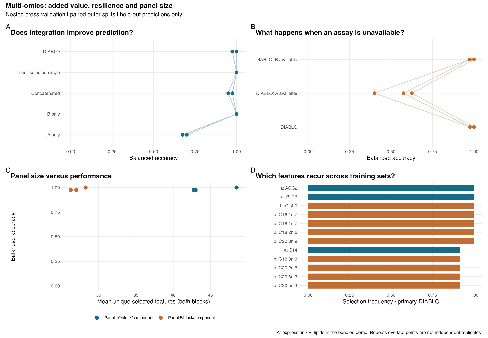

# r-multiomics-benchmark

## What it does

R scripts for comparing single-omics and multi-omics classification on paired data. The project runs glmnet on each block separately and on concatenated features, then compares those models with mixOmics DIABLO using the same train/test splits.

It also checks how DIABLO performs with one block missing at prediction time, and how smaller feature selections affect accuracy. You need both omics blocks for training and evaluation.

## Input

### Use your own data

```sh
Rscript run.R /path/to/data /path/to/results
```

The input folder needs three CSV files:

| File | Contents |
|---|---|
| `samples.csv` | `sample_id`, `outcome`, `stratum` |
| `block_a.csv` | `sample_id`, followed by numeric features |
| `block_b.csv` | `sample_id`, followed by numeric features |

Each row is an independent biological sample. Both blocks must contain the same unique sample IDs; the script matches rows by ID. Feature names must be unique within each block.

`outcome` is the class to predict. `stratum` balances the folds without entering the model—for example, genotype in the bundled dataset. Use a constant value if you do not need it. Default settings require at least four samples per outcome-by-stratum group.

Supply transformed continuous measurements, not raw sequencing counts. Missing values and repeated measurements are not supported. Any preprocessing that learns from multiple samples must be fitted within training folds; do not select features using all outcome labels before running the benchmark.

## Output

Start with `results/summary.md` and `results/overview.png`. The remaining files contain per-repeat scores, sample predictions, data splits, tuning results and selected features. Package versions and settings are saved in `results/run_info.txt`.

## Try it

### Run the example

Install the packages in R:

```r
install.packages(c("glmnet", "ggplot2", "patchwork", "ragg"))
if (!requireNamespace("BiocManager", quietly = TRUE)) install.packages("BiocManager")
BiocManager::install("mixOmics", ask = FALSE, update = FALSE)
```

From the project folder:

```sh
Rscript run.R
```


Settings are at the top of `run.R`; the analysis functions are in `benchmark.R`. Tested with R 4.6.1, mixOmics 6.36.0 and glmnet 5.1. The code requires glmnet >= 5.1.

### Verify the example

The bundled example completed in **97.36 seconds** on an Intel macOS machine with R 4.6.1 (40 mice, three repeats of four outer folds and three inner folds); installation is excluded. This is a measured example, not a runtime guarantee. No additional data download is needed and normal runs preserve the input CSVs.

```bash
Rscript verify_outputs.R
```

### How it works

The default run uses three repeats of nested cross-validation: four outer folds for testing and three inner folds for tuning. Scaling and feature selection use training data only. The tuning grids are defined in `run.R`.

Scores are **balanced accuracy**: recall averaged across classes. The “Inner-selected single” baseline chooses between A and B using inner-fold scores. Missing-block tests reuse the trained DIABLO model without refitting. Panel sizes count unique selected features across components; `keepX` itself is a per-block, per-component setting.

Repeats share samples, so their spread is not a confidence interval. Selected features are exploratory and need validation on new data.

### Example data and results



The figure compares prediction accuracy, performance with one omics block missing, feature-panel sizes, and how often features are selected across training sets.

[Nutrimouse](https://mixomics.org/wp-content/uploads/2025/01/rCCA-Nutrimouse-Case-Study.html) contains 40 mice, 120 preselected macroarray expression measurements and 21 hepatic fatty acids. The task is to predict five diets, with folds balanced by genotype. Lipid percentages are transformed with `log1p`; they remain compositional. Data details are in `data/PROVENANCE.txt`.

With the default settings, lipids alone score **1.000**, concatenation **0.967**, and DIABLO **0.983**. Adding expression does not improve prediction in this example. This is a small demonstration dataset: inner training folds contain only four mice per diet, and the published preprocessing and gene preselection precede this analysis.

### Other commands

```sh
Rscript run.R --check    # check input handling, splitting and scaling
Rscript run.R --prepare  # re-export Nutrimouse from mixOmics and run
```

Methods: [mixOmics DIABLO](https://guides.mixomics.org/mixOmics-Vignette/id_06.html) and [glmnet](https://glmnet.stanford.edu/articles/glmnet.html).

